Tools of use:  SNAP / QGis / Orfeo toolbox / Gdal

* Load raster, single band
* RGB color combination
* Spectra / NDVI / optical thematic maps / radiometric indices
* Extracting / visualising Spectra 
* (Map projection)
* PCA
* Filtering, including spatial, convolution etc.

## Getting data

We provide files obtained from Sentinel 2, which have been mosaiced and clipped to the area of interest and converted to multiband GeoTIFF format.

Additionally, the band values have been divided by 4095, to convert from the range of brightness levels (0-4095) to brightness as a ratio (0-1).

The source data you can find on https://scihub.copernicus.eu/

The multispectral data is in the file **allBands01a.tif**
You can download it from Dropbox: 

https://www.dropbox.com/s/aizkdm22crh9ydx/allBands01a.tif.zip?dl=0

This file contains all bands available from Sentinel 2, with band 8A placed in band 9, 9 in 10, etc.

## Load raster (single band, RGB combination)
Copy this file into your work directory and uncompress ("extract here"). 
Open QGIS and start a new project, save to the work directory.
Drag and drop this file onto the screen. 
It should automatically display

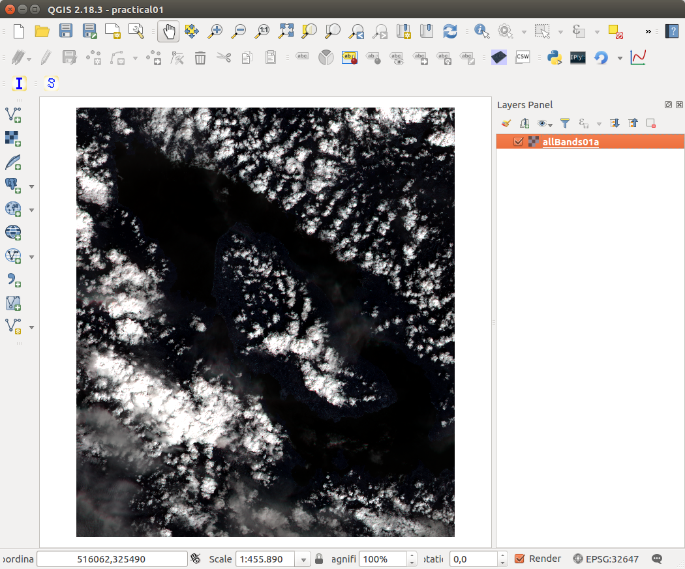

#### RGB
Right click on the layer in the layers panel and choose properties. 
Confirm that render type is Multiband color. Change blue to band 02, green to 03 and red to 04.
Set color enhancement ot stretch to Min/Max. Change min/max values to 0 for Min, and 1 for Max.

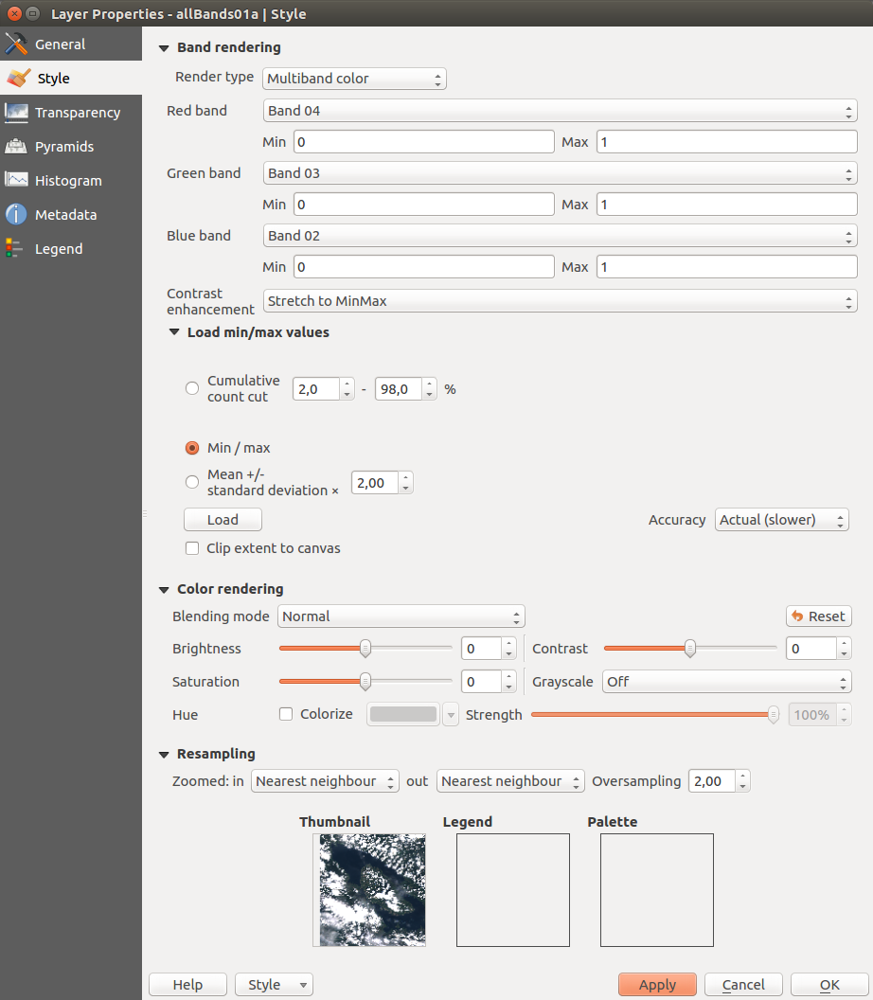

Click Apply and OK. You should now see true colour RGB.

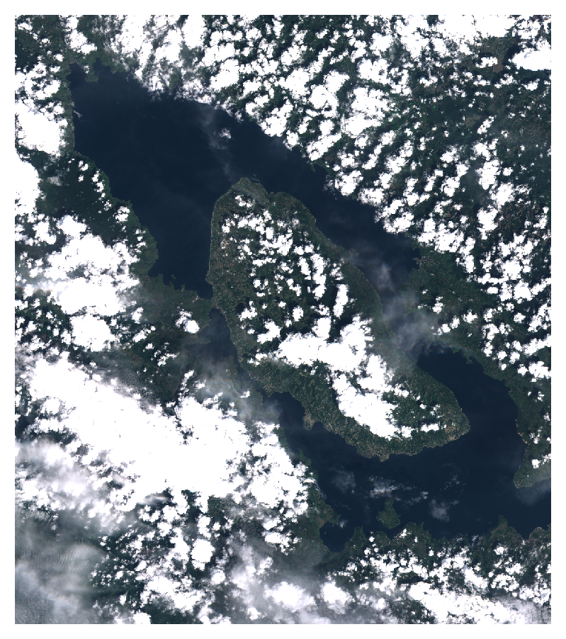

#### Singe band
Right click on the Layer in the Layers Panel, click duplicate, 
move the copied layer to the top, and rename to "singleband", click enable checkmark.
Right click on the Singleband layer in the layers panel and choose properties. 
Change render type to singleband pseudocolor, select band 11, interpolation linear color RdPu.
Load min/max values, use accuracy "Actual". Click classify.
In blending mode select "Overlay". Press Apply then OK.
You should now see high altitude clouds highlighted in purple. 

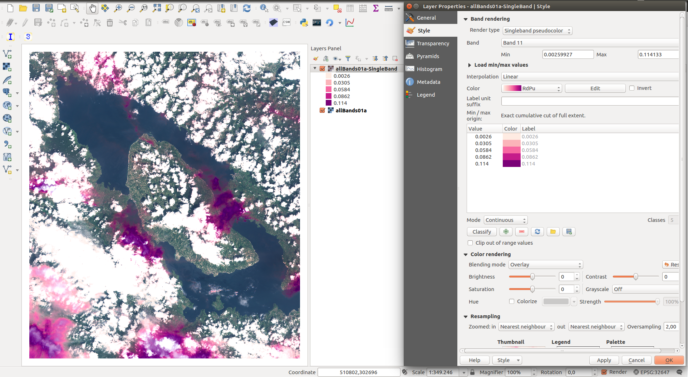

## Producing radiometric indices derived maps

To produced radiometric indices we will be using orfeo toolbox.
The correct tool to use is otbcli_RadiometricIndices

From the workspace directory run 

otbcli_RadiometricIndices -in allBands01a.tif -channels.blue 2 -channels.green 3 -channels.red 4 -channels.nir 8 -list Soil:BI2 Vegetation:NDVI Soil:CI -out randInd01.tif

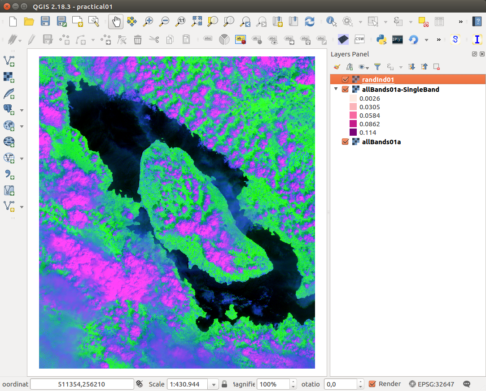

Zoom into area free of cloud cover and load min/max values while clipping extent to canvas.

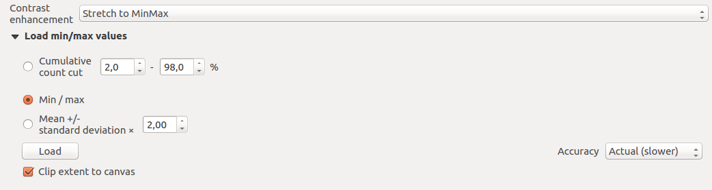

The resolution on this image is rather poor. Various channels of Sentinel 2 come at different resolution, the highest resolution channels are at 10 m/px, this image was downsampled to the lowest common resolution of all channels, that is 60 m/px. You can find the spatial resolution of all channels on this page: 

https://earth.esa.int/web/sentinel/user-guides/sentinel-2-msi/resolutions/spatial

For most radiometric indices we only need R, G, B, and NIR channels, these are available in 10 m/px, and you can download these from:

https://www.dropbox.com/s/ns3fdgmv7w3m22f/RGBNir01.tif.zip?dl=0

Place this image into your workspace directory, drag and drop into QGIS, 
and in properties change channels blue to band 01, green to 02 and red to 03.

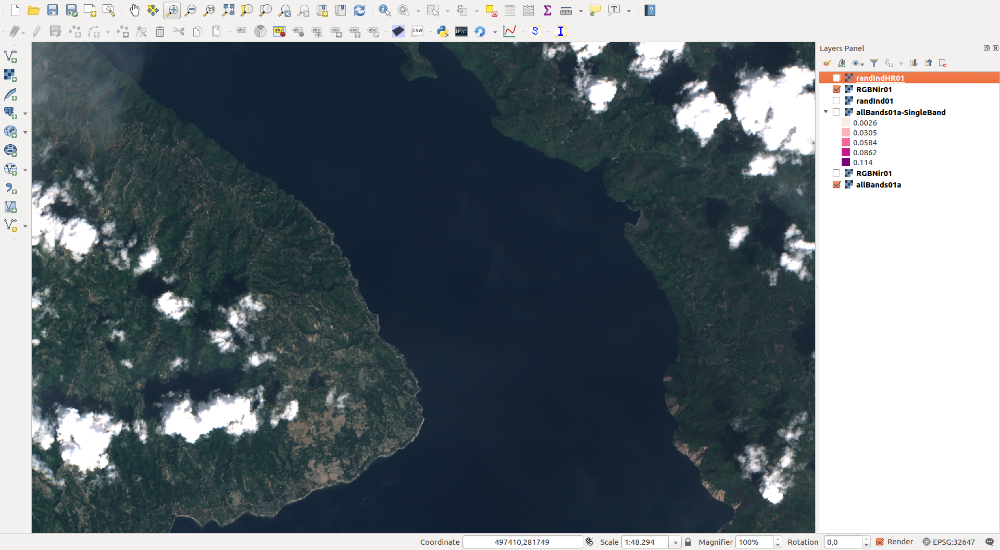

Lets re-run the otbcli_RadiometricIndices with high resolution data.

otbcli_RadiometricIndices -in RGBNir01.tif -channels.blue 1 -channels.green 2 -channels.red 3 -channels.nir 4 -list Soil:BI2 Vegetation:NDVI Soil:CI -out randIndHR01.tif

Add the output image (randIndHR01.tif), and edit min/max values in the same way as was done with low resolution image. Now you should see a lot more.

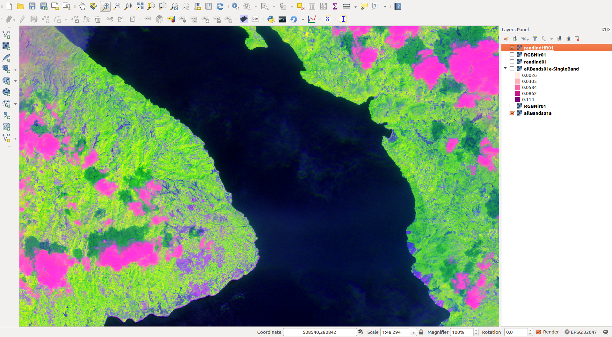

## Extracting / visualising Spectra
You can view spectra by means of "Temporal/Spectral Profile" plugin.
You can obtain this plugin from 

Plugins > Manage and Install Plugins

Select "allBands01a" layer, and start this plugin.

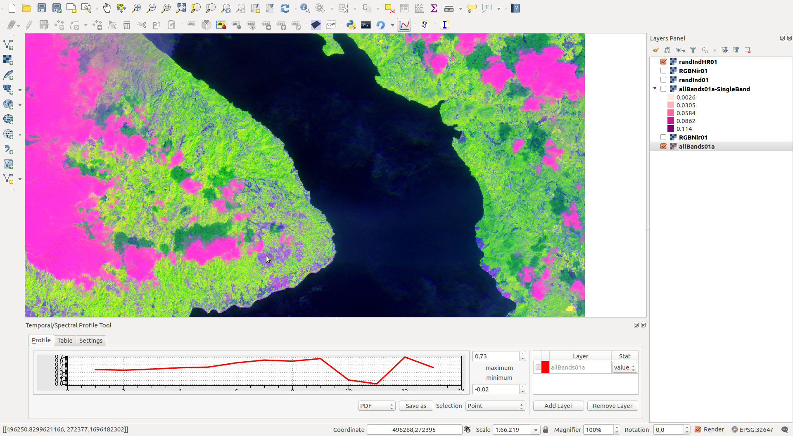

## Image Filtering
#### Obtaining a panchromatic
Using raster algebra (Raster > Raster Calculator), add all bands of RGBNir01 and divide by total number of bands (to find the average): 

("RGBNir01@1" + "RGBNir01@2" + "RGBNir01@3" + "RGBNir01@4") / 4.0

Save it in your workspace directory, as PanChrom01 in GeoTIFF format. 
You should now see a grayscale image. Edit min/max values for better display.

#### Spatial filtering
We can sharpen this image using orfeo toolbox. As long as your orfeo toolbox installed correctly, you should be able to access it from within QGIS, as Processing > Toolbox.

A simple high-pass filter is a difference of the original image and a smoothed version.
Choose: Image Filtering > Smoothing (mean)
Select smoothing type "mean", radius of 2, and save in the workspace directory as LowPass.

Next, use Raster Calculator to subtract Low Pass image from the Pan Chromatic. 
Save it as HighPass.

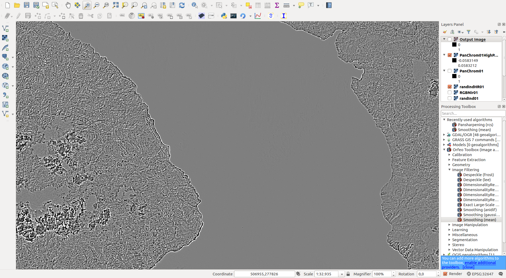

#### Pan Sharpening
As mentioned earlier, sattelite data often comes at various spatial resolutions at different sensors. 
A common technique to enhance the image quality is to apply a monochrome image from high resolution channels (panchromatic) to low resolution channels. The technique is called pan sharpening. 
For the sake of an excersize we will apply this technique to the low resolution radiometric indices derived image, so we can compare it with the full resolution derived image.

The correct orfeo tool to use is otbcli_BundleToPerfectSensor.
This command must be run from the terminal:

otbcli_BundleToPerfectSensor -inp PanChrom01.tif -inxs randInd01.tif -out randInd01PanSharp01.tif

Adjust the min/max values, and you should now be able to compare High Resolution, Low Resolution and Pan Sharpened versions of derived radiometric product image:

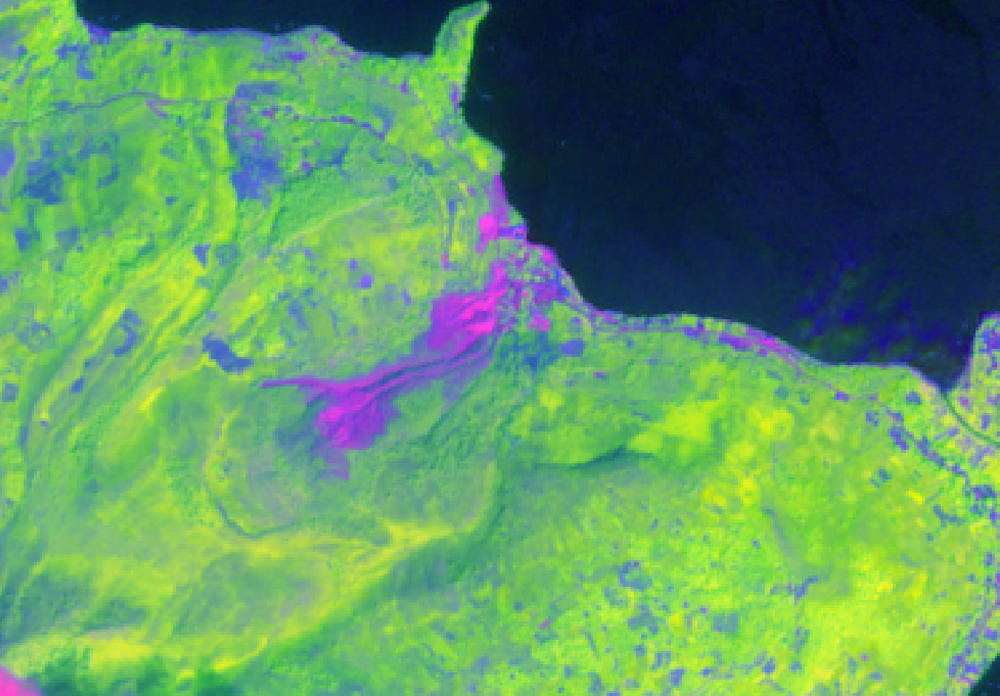
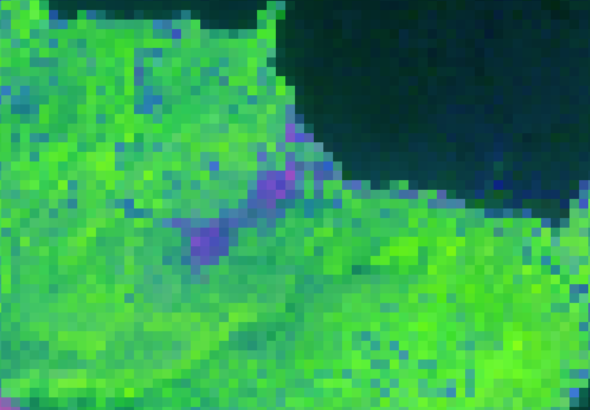
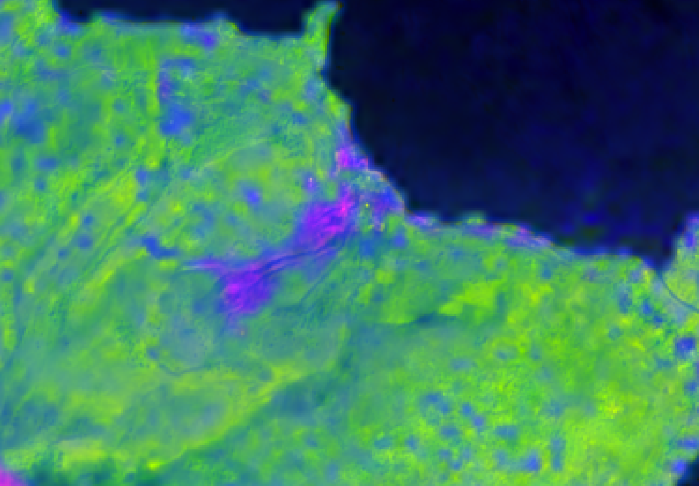
